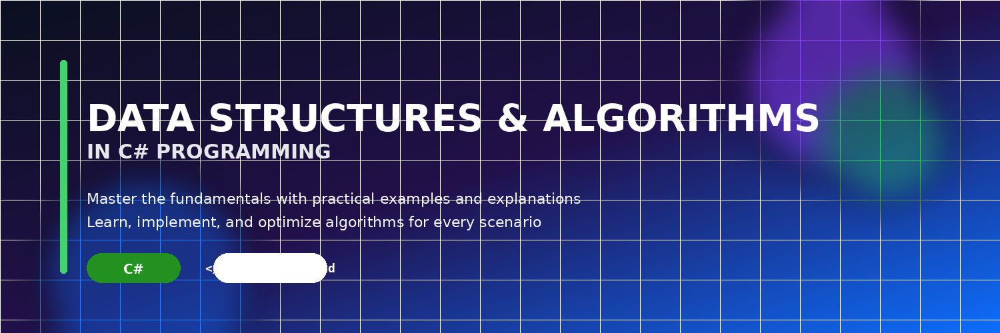

---

# 📊 Data Structures & Algorithms in C#

<div align="center">

## 🎓 Professional Learning & Implementation Guide

### Comprehensive Guide to Mastering Data Structures and Algorithms using C#

[](https://github.com/ZainulabdeenOfficial/Data-Structures-and-Algorithms-C-Sharp-)
[](https://github.com/ZainulabdeenOfficial/Data-Structures-and-Algorithms-C-Sharp-)
[](https://github.com/ZainulabdeenOfficial/Data-Structures-and-Algorithms-C-Sharp-)

---



---

A complete learning resource featuring implementations, theory, and practical examples of essential data structures and algorithms.

[Get Started](#-quick-start) • [Documentation](#-documentation) • [Topics](#-topics-covered) • [Contribute](#-contributing)

</div>

---

## 🎯 Overview

This repository is a comprehensive educational resource for learning and implementing **Data Structures** and **Algorithms** using **C#**. Whether you're a beginner or an experienced developer preparing for technical interviews, you'll find well-documented, production-ready implementations with detailed explanations.

### Key Features
- ✅ **Well-documented code** with comments and explanations
- ✅ **Theory and practice** combined for deeper understanding
- ✅ **Multiple data structures** implementations
- ✅ **Algorithm implementations** with complexity analysis
- ✅ **Real-world examples** and use cases
- ✅ **Time & Space Complexity** analysis for each topic
- ✅ **Production-ready code** following industry standards

---

## 📚 Documentation

### What are Data Structures?

**Data Structures** are specialized formats for organizing, managing, and storing data in a way that enables efficient access and modification.

```
┌─────────────────────────────────────────────────────────┐
│              DATA STRUCTURES                             │
├─────────────────────────────────────────────────────────┤
│                                                           │
│  ┌──────────────────────┐  ┌──────────────────────┐    │
│  │ PRIMITIVE            │  │ ABSTRACT             │    │
│  │                      │  │                      │    │
│  │ • int                │  │ • Array              │    │
│  │ • float              │  │ • Linked List        │    │
│  │ • char               │  │ • Stack              │    │
│  │ • bool               │  │ • Queue              │    │
│  │ • double             │  │ • Tree               │    │
│  │                      │  │ • Graph              │    │
│  │ (Single value)       │  │ • Hash Table         │    │
│  └──────────────────────┘  └──────────────────────┘    │
│                                                           │
└─────────────────────────────────────────────────────────┘
```

### What are Algorithms?

**Algorithms** are step-by-step procedures or formulas for solving a problem or completing a task, often involving searching and manipulating data structures.

```
┌─────────────────────────────────────────────────────────┐
│              ALGORITHM CATEGORIES                        │
├─────────────────────────────────────────────────────────┤
│                                                           │
│  • Sorting (Bubble, Quick, Merge, Heap, etc.)           │
│  • Searching (Binary Search, Linear Search)             │
│  • Graph Algorithms (DFS, BFS, Dijkstra)                │
│  • Dynamic Programming                                  │
│  • Greedy Algorithms                                    │
│  • Divide & Conquer                                     │
│  • Backtracking                                         │
│                                                           │
└─────────────────────────────────────────────────────────┘
```

---

## 📖 Core Concepts & Terminology

| Term | Description |
|------|-------------|
| **Algorithm** | A set of step-by-step instructions to solve a specific problem |
| **Data Structure** | A way of organizing data so it can be used efficiently |
| **Time Complexity** | Measure of the amount of time an algorithm takes to run |
| **Space Complexity** | Measure of the amount of memory an algorithm uses |
| **Big O Notation** | Mathematical notation describing algorithm performance (O(1), O(n), O(n²), etc.) |
| **Recursion** | A technique where a function calls itself |
| **Divide and Conquer** | Breaking complex problems into smaller sub-problems |
| **Brute Force** | Trying all possible solutions to find the best one |
| **Optimization** | Improving algorithm efficiency in time or space |

---

## 📊 Topics Covered

### 1. **Linear Data Structures**

```
ARRAY
┌─────────┬─────────┬─────────┬─────────┐
│  [0]    │  [1]    │  [2]    │  [3]    │
└─────────┴─────────┴─────────┴─────────┘

LINKED LIST
┌─────────┬──┐     ┌─────────┬──┐     ┌─────────┬─────┐
│  Data   │──┼────→│  Data   │──┼────→│  Data   │ NULL│
└─────────┴──┘     └─────────┴──┘     └─────────┴─────┘

STACK (LIFO - Last In First Out)
     ┌─────────┐
     │ TOP [3] │
     ├─────────┤
     │ [2]     │
     ├─────────┤
     │ [1]     │
     ├─────────┤
     │ [0]     │
     └─────────┘

QUEUE (FIFO - First In First Out)
FRONT [1] → [2] → [3] → [4] REAR
```

### 2. **Tree Data Structures**

```
BINARY TREE
        ┌─────────┐
        │    1    │
        └────┬────┘
             │
        ┌────┴────┐
        │         │
    ┌───┴───┐ ┌───┴───┐
    │   2   │ │   3   │
    └─┬───┬─┘ └──────
      │   │
   ┌──┘   └──┐
   │         │
 ┌─┴─┐     ┌─┴─┐
 │ 4 │     │ 5 │
 └───┘     └───┘

BINARY SEARCH TREE (BST)
        ┌─────────┐
        │    10   │
        └────┬────┘
             │
        ┌────┴────┐
        │         │
    ┌───┴───┐ ┌───┴────┐
    │   5   │ │   15   │
    └──────┘ └────┬────┘
                  │
            ┌─────┴─────┐
            │           │
        ┌───┴───┐   ┌───┴───┐
        │  12   │   │  20   │
        └───────┘   └───────┘
```

### 3. **Hash-Based Structures**

```
HASH TABLE (Hash Map)
┌──────────────────────────────┐
│  Hash Table with Buckets     │
├──────────────────────────────┤
│ [0] → [bucket]               │
│ [1] → [bucket] → [bucket]   │
│ [2] → [bucket]               │
│ [3] → NULL                   │
│ [4] → [bucket]               │
│ ... → ...                    │
└──────────────────────────────┘
```

### 4. **Graph Structures**

```
UNDIRECTED GRAPH
    (A) ─── (B)
     │ \   / │
     │  \ /  │
     │  (C)  │
     │  / \  │
     │ /   \ │
    (D) ─── (E)

DIRECTED GRAPH (DAG)
    (A) ──→ (B) ──→ (C)
     │       │       ↑
     │       └──────→│
     └──────────────→(D)
```

---

## 🎓 Learning Path

### Beginner Level
1. Arrays and Lists
2. Strings
3. Stacks and Queues
4. Basic Sorting Algorithms
5. Basic Searching Algorithms

### Intermediate Level
6. Linked Lists
7. Trees and Binary Search Trees
8. Heaps and Priority Queues
9. Hash Tables
10. Advanced Sorting (Merge Sort, Quick Sort)

### Advanced Level
11. Graphs and Graph Traversal
12. Dynamic Programming
13. Greedy Algorithms
14. Backtracking
15. NP Problems and Approximation

---

## ⚡ Complexity Analysis

### Big O Time Complexities

| Complexity | Name | Example |
|-----------|------|---------|
| O(1) | Constant | Array access by index |
| O(log n) | Logarithmic | Binary search |
| O(n) | Linear | Simple loop |
| O(n log n) | Linearithmic | Merge sort, Quick sort |
| O(n²) | Quadratic | Bubble sort, Selection sort |
| O(n³) | Cubic | Triple nested loop |
| O(2ⁿ) | Exponential | Fibonacci (naive) |
| O(n!) | Factorial | Permutations |

### Algorithm Complexity Comparison

```
         Operations
              │
         O(n!)│     ╱
              │    ╱
         O(2ⁿ)│   ╱
              │  ╱
          O(n³)│╱ 
              │╱
         O(n²)│━━━━━━
              │\
       O(n log n)│ \
              │   \
           O(n)│    \
              │      \
          O(log n)│   \
              │        \
            O(1)├────────\────────
              │          
              └─────────────────── n (Input Size)
```

---

## 🚀 Quick Start

### Prerequisites
- .NET SDK (version 6.0 or higher)
- C# knowledge (basics)
- Any IDE (Visual Studio, Visual Studio Code, or Rider)

### Installation

```bash
# Clone the repository
git clone https://github.com/ZainulabdeenOfficial/Data-Structures-and-Algorithms-C-Sharp-.git

# Navigate to the project
cd Data-Structures-and-Algorithms-C-Sharp-

# Build the project
dotnet build

# Run examples
dotnet run
```

---

## 📁 Repository Structure

```
Data-Structures-and-Algorithms-C-Sharp-/
│
├── README.md                 # Main documentation (you are here)
├── Theory.md                 # Detailed theory explanations
├── LICENSE                   # GPL 3.0 License
│
├── DataStructures/
│   ├── Arrays/
│   ├── LinkedLists/
│   ├── Stacks/
│   ├── Queues/
│   ├── Trees/
│   ├── Graphs/
│   └── HashTables/
│
└── Algorithms/
    ├── Sorting/
    ├── Searching/
    ├── DynamicProgramming/
    ├── GraphAlgorithms/
    └── Other/
```

---

## 💡 Use Cases & Applications

### Real-World Applications of Data Structures & Algorithms

| Data Structure | Use Case |
|---|---|
| **Array** | Storing collections, matrix operations, cache |
| **Linked List** | Music player playlists, browser history |
| **Stack** | Function call stack, undo/redo functionality |
| **Queue** | Print queue, task scheduling, BFS |
| **Tree** | File systems, DOM structure, databases |
| **Graph** | Social networks, GPS navigation, web crawlers |
| **Hash Table** | Caching, indexing, database operations |
| **Heap** | Priority queues, heap sort, Dijkstra's algorithm |

---

## 📊 Algorithm Categories & Examples

### Sorting Algorithms
```
Bubble Sort:    O(n²) average, O(n²) worst
Selection Sort: O(n²) average, O(n²) worst
Insertion Sort: O(n²) average, O(n²) worst
Merge Sort:     O(n log n) average, O(n log n) worst
Quick Sort:     O(n log n) average, O(n²) worst
Heap Sort:      O(n log n) average, O(n log n) worst
```

### Searching Algorithms
```
Linear Search:  O(n) time complexity
Binary Search:  O(log n) time complexity (requires sorted array)
```

### Graph Algorithms
```
BFS (Breadth-First Search):  O(V + E)
DFS (Depth-First Search):    O(V + E)
Dijkstra's Algorithm:        O((V + E) log V)
Floyd-Warshall:              O(V³)
```

---

## 🤝 Contributing

We welcome contributions! Here's how you can help:

1. **Fork** the repository
2. **Create** a new branch (`git checkout -b feature/amazing-feature`)
3. **Commit** your changes (`git commit -m 'Add amazing feature'`)
4. **Push** to the branch (`git push origin feature/amazing-feature`)
5. **Open** a Pull Request

### Contribution Guidelines
- Follow C# naming conventions
- Add comments and documentation
- Include time and space complexity analysis
- Add example use cases
- Update README if adding new topics

---

## 📚 Additional Resources

### Online Platforms
- [LeetCode](https://leetcode.com) - Practice coding problems
- [HackerRank](https://www.hackerrank.com) - Algorithm challenges
- [CodeSignal](https://codesignal.com) - Interview prep
- [GeeksforGeeks](https://www.geeksforgeeks.org) - Tutorials and explanations

### Books
- "Introduction to Algorithms" - Cormen, Leiserson, Rivest, Stein
- "Cracking the Coding Interview" - Gayle Laakmann McDowell
- "The Algorithm Design Manual" - Steven Skiena

### YouTube Channels
- Kunal Kushwaha
- Abdul Bari
- Striver (DSA in C++)
- Code with Harry

---

## 📝 License

This project is licensed under the **GNU General Public License v3.0** - see the [LICENSE](LICENSE) file for details.

---

## 👨‍💻 Author

**Zainulabedin**
- GitHub: [@ZainulabdeenOfficial](https://github.com/ZainulabdeenOfficial)
- Repository: [Data Structures & Algorithms in C#](https://github.com/ZainulabdeenOfficial/Data-Structures-and-Algorithms-C-Sharp-)

---

## ⭐ Support

If you find this repository helpful:
- ⭐ **Star** the repository
- 🔔 **Watch** for updates
- 📢 **Share** with others
- 💬 **Contribute** your improvements

---

## 📞 Get in Touch

Have questions or suggestions? Feel free to:
- Open an [Issue](https://github.com/ZainulabdeenOfficial/Data-Structures-and-Algorithms-C-Sharp-/issues)
- Start a [Discussion](https://github.com/ZainulabdeenOfficial/Data-Structures-and-Algorithms-C-Sharp-/discussions)
- Fork and contribute

---

<div align="center">

### Made with ❤️ for the developer community

**Happy Learning! 🚀**

</div>
